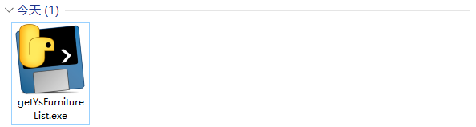
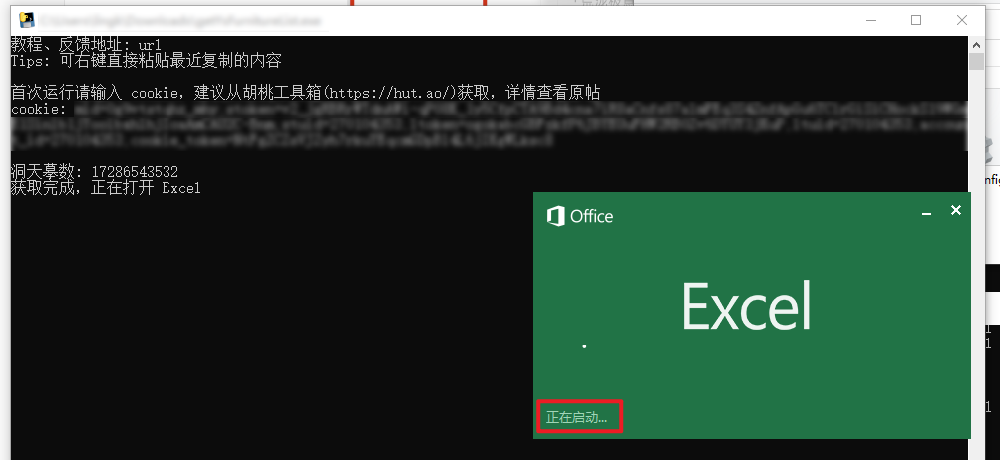
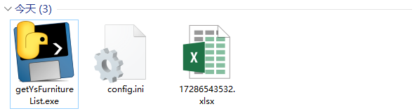
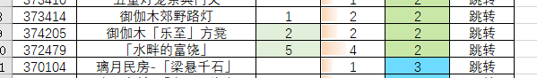
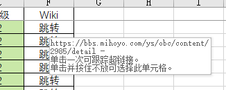
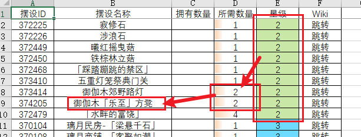

# README

## getYsFurnitureList.py

### 简介

一个原神尘歌壶工具，通过洞天摹数获取摆件列表和相关信息，保存到 Excel。

### 快速开始

1. 下载软件，解压到任意位置。
   
   
2. 双击运行，仅首次运行时需要输入cookie，后续使用将直接从配置文件读取。
   

3. 获取cookie的方法很多，这里推荐直接从[胡桃工具箱](https://hut.ao/)复制，这也是我最常用的工具，是一个 Windows 平台的开源的原神工具箱。
   

4. 输入获取的洞天摹数，回车运行。程序应该会自动完成获取，并打开Excel。
   

5. 在游戏中使用摹本，将相应已有摆设的数量录入表格即可。
   

### 额外说明

Excel 的布局和取色参考了[这位大佬](https://nga.178.com/nuke.php?func=ucp&__inchst=UTF-8&uid=8529609)的赠礼套装工具表（https://nga.178.com/read.php?tid=34126505），用法大致相同。

- 本项目开源，您的数据全部保存在本地，不存在主动泄露的风险，您可以拉取源码使用。
- 首次运行后会得到另外两个文件，getYsFurnitureList.exe 是程序本体，config.ini 是程序的配置文件，明文保存有您的cookie信息；17286543532.xlsx
  是以洞天摹数命名的 Excel 文件。
  

- Tips: 摆设的拥有数量大于或等于所需数量时显示绿底
  
- Tips: 跳转按钮是超链接，单击能够跳转到对应摆设的 Wiki，方便查看获取途径等信息。
  
- 摆设的默认排序规则是先根据星级升序、再根据所需数量升序、最后根据ID升序。
- Tips: 根据排序规则，推荐的录入方法是记忆星级、数量和名称，并按前述的顺序查找。
  
  

### 开发说明

程序流程比较简单，甚至不需要画图。先从配置文件获取 cookie，若无则提示用户输入并保存到配置文件；用户输入需要获取的洞天摹数；构造get请求，若 cookie 失效则重复第一步；解析json数据；将数据填入 Excel 并设置格式；程序结束。

整个程序关键的只有构造请求这一步，经过测试，接口信息可能如下。

URL: https://api-takumi.mihoyo.com/event/e20200928calculate/v1/furniture/blueprint

必传参数

| key        | value        | 说明         |
| ---------- | ------------ | ------------ |
| region     | cn_gf01      | 可能是服务器 |
| share_code | 10或11位数字 | 洞天摹数     |

所需cookie: cookie_token 和 account_id，经测试只需要这两个对应。